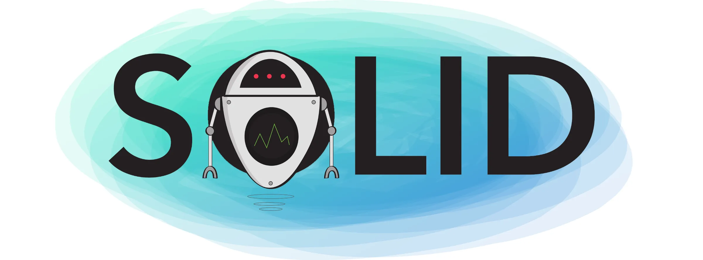

# SOLID

## O que é SOLID?

SOLID é um acrõnimo criado por Michael Feathers para observar 5 princípios da programação orientada a objetos que são considerados boas práticas para o desenvolvimento de software, facilitando a expansão e manutenção do código.

Esses príncipios são fundamentais a programação orientada a objetos, e podem ser aplicados em qualquer linguagem que adote este paradigma.

### Os 5 princípios SOLID

1. **Princípio da Responsabilidade Única (SRP - Single Responsibility Principle):** O SRP afirma que uma classe deve ter apenas uma responsabilidade ou tarefa específica no sistema. Isso ajuda a evitar classes inchadas que fazem muitas coisas e torna o código mais fácil de entender e manter.

2. **Princípio do Aberto/Fechado (OCP - Open/Closed Principle):** O OCP estabelece que as entidades de software (classes, módulos, etc.) devem estar abertas para extensão, mas fechadas para modificação. Isso significa que você deve poder adicionar novos recursos ou comportamentos sem alterar o código existente.

3. **Princípio da Substituição de Liskov (LSP - Liskov Substitution Principle):** O LSP diz que objetos de uma classe derivada devem ser capazes de substituir objetos da classe base sem afetar a integridade do programa. Em outras palavras, as subclasses devem ser compatíveis com as superclasses.

4. **Princípio da Segregação de Interfaces (ISP - Interface Segregation Principle):** O ISP sugere que as interfaces de uma classe devem ser segregadas em interfaces menores e mais específicas, em vez de ter uma única interface grande. Isso evita que as classes implementem métodos que não precisam, tornando o código mais coeso.

5. **Princípio da Inversão de Dependência (DIP - Dependency Inversion Principle):** O DIP enfatiza que as classes de alto nível não devem depender de classes de baixo nível, mas sim de abstrações. Além disso, ele incentiva a inversão do controle, permitindo que módulos de baixo nível dependam de abstrações, tornando o código mais flexível e facilmente adaptável a mudanças.

### Vantagens do SOLID

O uso dos princípios SOLID traz diversas vantagens para o desenvolvimento de software, aqui estão algumas das que eu encontrei:

- **Facilita a manutenção:** O SOLID propõe uma abordagem de código mais limpo e organizada, tornando o software mais fácil de entender e manter, isso reduz a probabilidade de erros e facilita a correção de bugs.
- **Aumenta a reutilização de código:** Implementações que aderem ao SOLID, de forma geral são mais coesas e possuem menos acoplamento, o que possibilita a reutilização de código em diversas partes do software.
- **Melhora a testabilidade:** Classes que seguem o SOLID tendem a ser mais fáceis de testar, pois possuem apenas 1 responsabilidade e são claramente definidas, isso facilita a criação de testes unitários.
- **Aumenta a compreensão do código:** Códigos que seguem os príncipios SOLID são mais legíveis e compreensíveis, facilitando a colaboração entre outros membros da equipe e a manutenção a longo prazo.
- **Melhora a arquitetura de forma geral:** O SOLID contribui para uma arquitetura de software mais robusta e flexível, tornando o software adaptável a mudanças nos requisitos e nas necessidades dos usuários.

Em resumo, o uso dos princípios do SOLID resulta em software de maior qualidade, mais flexível e fácil de manter. Isso é crucial em projetos de desenvolvimento de software de longo prazo, nos quais a escalabilidade e a manutenção são fatores críticos para o sucesso.
